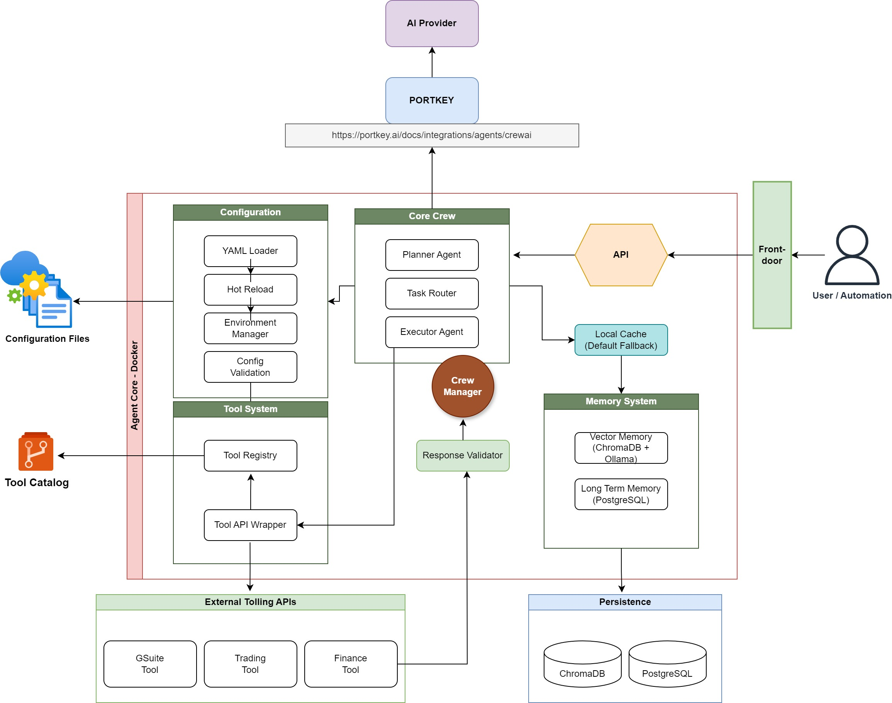

# COGNITION



A production-ready virtual interface for building and deploying intelligent agents, powered by CrewAI and enhanced with enterprise-grade features through Cognition Core.

## Overview

Cognition serves as an intelligent virtual interface for task orchestration and agent management. It prevents the "agent graveyard" problem by providing:

1. **Standardized Agent Development**
   - Consistent patterns through Cognition Core
   - Reusable tool ecosystems
   - Unified configuration management

2. **Intelligent Task Management**
   - Hierarchical task planning with manager agents
   - Dynamic tool allocation
   - Context-aware execution

3. **Enterprise Integration**
   - Cloud-native deployment options
   - Scalable memory systems
   - Production monitoring

4. **Virtual Interface**
   - Natural language task submission
   - Execution feedback and monitoring
   - Context-aware responses

## Architecture

### Core Components

#### 1. Virtual Interface Layer
- **Manager Agent**: Orchestrates task planning and execution
- **Chat LLM**: Handles natural language interactions
- **Cognitive Architecture**: Processes tasks and provides intelligent feedback

#### 2. Task Management
- **Task Planning**: Dynamic task breakdown and allocation
- **Context Management**: Maintains execution context
- **Tool Selection**: Intelligent tool assignment

#### 3. Memory Systems
- **Short-term**: Quick access to recent context
- **Long-term**: Persistent knowledge storage
- **Entity Memory**: Relationship tracking

#### 4. Tool Integration
- **Dynamic Loading**: Auto-discovery of available tools
- **Version Management**: Tool compatibility tracking
- **Response Validation**: Quality assurance

## Usage Patterns

### 1. Container Deployment
```python
from cognition import Cognition

# Initialize with default settings
cognition = Cognition()

# Start API server
app = cognition.api
```

### 2. Package Integration
```python
from cognition import Cognition

# Custom configuration
cognition = Cognition(
    config_dir="path/to/config",
    memory_enabled=True,
    tool_discovery=True
)

# Create custom agent
agent = cognition.create_agent(
    role="researcher",
    tools=["web_search", "document_reader"]
)
```

## Configuration

### Agent Configuration (agents.yaml)
```yaml
researcher:
  role: "Research Specialist"
  goal: "Gather and analyze information"
  backstory: "Experienced research analyst with expertise in data analysis"
  llm: "gpt-4"
  tools:
    - web_search
    - document_reader
    - data_analyzer

manager:
  role: "Task Coordinator"
  goal: "Orchestrate and optimize task execution"
  llm: "gpt-4"
  verbose: true
```

### Task Configuration (tasks.yaml)
```yaml
research_task:
  description: "Conduct comprehensive research on {topic}"
  expected_output: "Detailed analysis report"
  tools:
    - web_search
    - document_reader
  context_required: true
```

## Enterprise Features

### 1. Scalability
- Horizontal scaling through containerization
- Independent tool scaling
- Distributed memory systems

### 2. Monitoring
- Task execution metrics
- Agent performance tracking
- Resource utilization

### 3. Security
- Role-based access control
- Tool usage policies
- Audit logging

## Development Workflow

1. **Local Development**
   ```bash
   # Install dependencies
   pip install cognition-ai[dev]

   # Run tests
   pytest tests/

   # Start local server
   cognition serve
   ```

2. **Container Deployment**
   ```bash
   # Build container
   docker build -t cognition .

   # Run container
   docker run -p 8000:8000 cognition
   ```

## Environment Variables

Required:
- `PORTKEY_API_KEY`: Portkey API key
- `PORTKEY_VIRTUAL_KEY`: Portkey virtual key

Optional:
- `COGNITION_CONFIG_DIR`: Configuration directory
- `MEMORY_ENABLED`: Enable memory systems
- `TOOL_DISCOVERY`: Enable tool discovery
- `LOG_LEVEL`: Logging level

## Contributing

1. Fork the repository
2. Create a feature branch
3. Submit a pull request with tests

## License

MIT