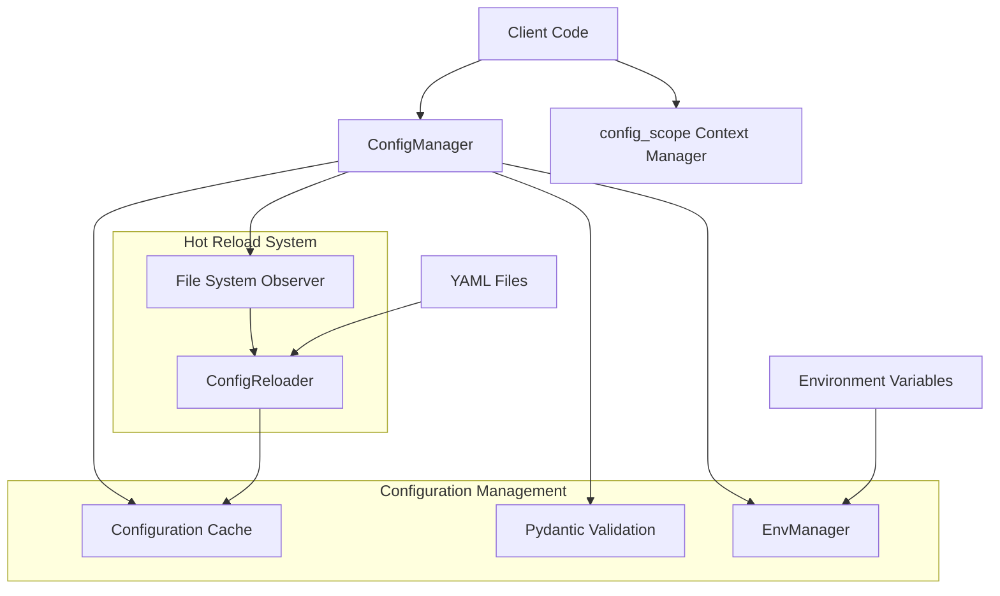

# Configuration Service Documentation

## Overview
The Configuration Service provides a robust, production-ready system for managing YAML-based configurations with dynamic loading and hot reload capabilities. It's designed to integrate with CrewAI's memory objects while maintaining secure, validated, and flexible configuration management.

## Architecture

## Core Components

### ConfigManager
- Initializes with a configuration directory
- Manages configuration loading and caching
- Provides secure access methods
- Implements hot reload capability
- Handles cleanup through context management

### Validation System
- Uses Pydantic models for schema validation
- Validates configuration structure and types
- Prevents propagation of invalid configurations
- Custom `ConfigValidationError` for error handling

### Environment Management
- `EnvManager` handles environment variable overrides
- Configurable prefix for environment variables (default: "CREW_")
- Dynamic override of configuration values

### Hot Reload Mechanism
- Watches for file modifications using `watchdog`
- Automatically reloads modified configurations
- Maintains configuration consistency during runtime

## Advantages

1. **Dynamic Configuration Management**
   - Real-time configuration updates without system restart
   - Automatic file watching and reloading
   - Safe handling of configuration changes

2. **Strong Validation**
   - Pydantic-based schema validation
   - Type checking and constraint validation
   - Clear error reporting

3. **Flexible Access Patterns**
   - Nested value