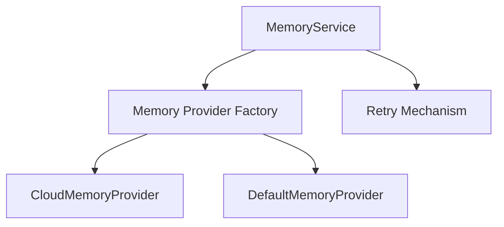

# Memory Service Documentation

## Overview
The Memory Service is responsible for managing the memory configuration for CrewAI. It reads connection settings from the CrewAI configuration (as defined in [config.md](./config.md) and implemented in [config_service.py](./config_service.py)) and initializes the appropriate memory provider. When configuration details for cloud-based or external memory systems (e.g. Redis, Firestore, etc.) are present, the Memory Service will establish a connection using those settings. If not, it will default to CrewAI's built-in in-memory caching.

## Architecture



## Core Components

### MemoryService
- **Configuration Parsing:** Reads memory settings from the provided configuration.
- **Provider Initialization:** Uses a factory approach to choose the appropriate memory provider.
- **Dynamic Switching:** Supports real-time switching between memory providers if configuration changes.
- **Unified API:** Exposes a common interface for memory operations (e.g. `get`, `set`).

### Memory Provider Factory
- **CloudMemoryProvider:** Connects to cloud-based memory systems with a built-in incremental backoff retry mechanism to handle transient connectivity issues.
- **DefaultMemoryProvider:** Provides fallback caching using CrewAI's default in-memory mechanism when no external configuration is specified.

## Retry Mechanism
For cloud-based memory providers, a simple incremental backoff retry mechanism is implemented. It will attempt to connect a number of times (configurable via the memory config) before raising an error.

## Usage Example
```python
from src.cognition.svc.memory_service import MemoryService

# Example memory configuration for a cloud provider (e.g., Redis)
memory_config = {
    "provider": "redis",
    "config": {
        "host": "redis.example.com",
        "port": 6379,
        "db": 0,
        "retry": {
            "max_attempts": 3,
            "backoff_factor": 1
        }
    }
}

# Initialize MemoryService with a configuration
memory_service = MemoryService(memory_config)
memory_service.connect()

# Get the active provider and perform operations
memory_provider = memory_service.get_provider()
memory_provider.set("key", "value")
value = memory_provider.get("key")
```

## Advantages
- **Unified Interface:** Simplifies integration by providing a single API for different memory providers.
- **Dynamic Configuration:** Enables real-time switching between cloud providers and default caching.
- **Resilient Connectivity:** Implements retry logic to cope with transient network issues.
