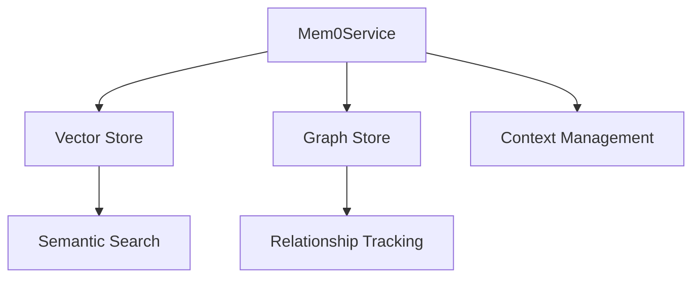

# Mem0 Service Documentation

## Overview
The Mem0 Service provides integration with Mem0's open-source memory layer, offering enhanced memory capabilities for AI agents. This service works alongside the existing Memory Service, providing additional features like semantic search and relationship tracking while maintaining compatibility with the project's architecture.

## Architecture



## Core Components

### Vector Store
- Handles semantic search capabilities
- Stores embeddings for efficient similarity search
- Uses ChromaDB for lightweight, embedded storage

### Graph Store
- Manages entity relationships
- Tracks conversation context
- Uses SQLite for simple, embedded storage

### Context Management
- Provides contextual awareness
- Manages user preferences
- Handles conversation history

## Usage Example
```python
from src.cognition.svc.mem0_service import Mem0Service

# Initialize the service
config = {
    "storage_path": "./data/mem0",
    "vector_store": {
        "dimension": 384,
        "similarity": "cosine"
    },
    "graph_store": {
        "path": "./data/mem0/relationships.db"
    }
}

mem0_service = Mem0Service(config)

# Add new memory
await mem0_service.add_memory({
    "content": "User prefers dark mode in applications",
    "type": "preference",
    "entities": ["user", "dark_mode"]
})

# Search memories
results = await mem0_service.search_memories("user interface preferences")

# Get context
context = mem0_service.get_context("user_preferences")
```

## Advantages
- **Self-hosted:** Complete control over data and storage
- **Lightweight:** Uses embedded databases for simple deployment
- **Extensible:** Easy to add new features or modify existing ones
- **Privacy-focused:** All data stays within your infrastructure

## Integration with Existing Architecture
The Mem0 Service complements the existing Memory Service by:
1. Providing semantic search capabilities
2. Managing entity relationships
3. Offering context-aware memory retrieval
4. Supporting self-hosted storage solutions 